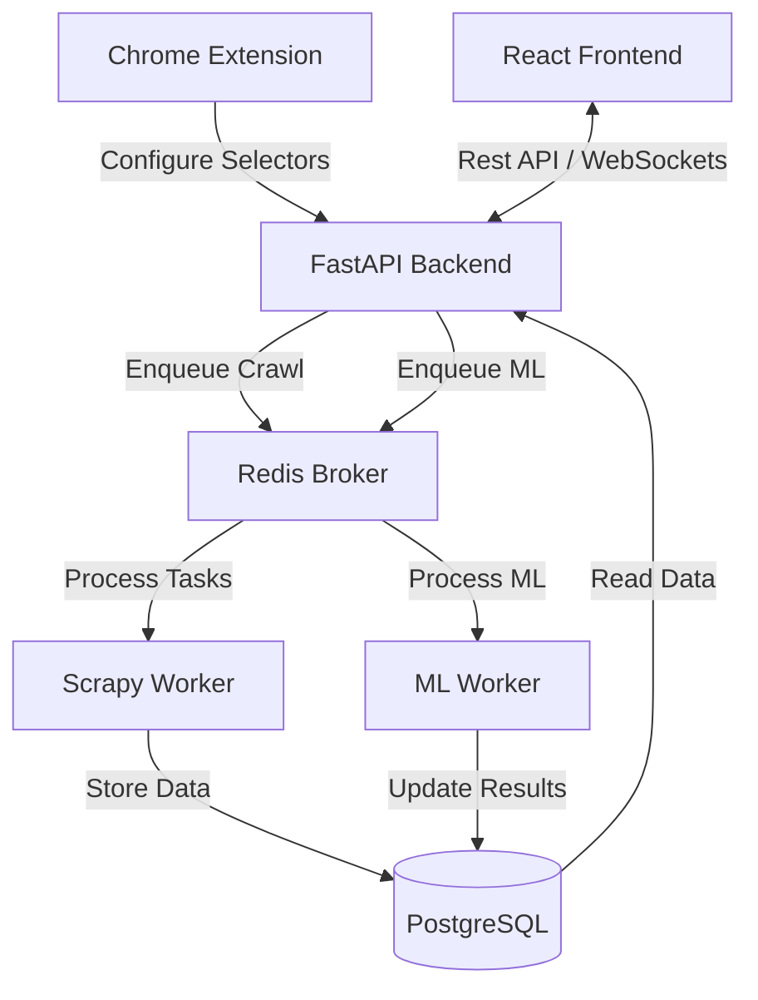

# Data Acquisition & ML Platform

A comprehensive system designed for automated web scraping, data processing, and machine learning model training. This platform provides a seamless workflow from point-and-click data extraction to visual model evaluation.

## Project Architecture

The platform is composed of several specialized modules that communicate via Redis and a shared PostgreSQL database.



## Module Overview

- **[Backend](./backend)**: A FastAPI server that handles API requests, manages the shared database, and orchestrates Celery tasks for scraping and machine learning.
- **[Frontend](./frontend)**: A React-based dashboard built with Vite, featuring a Dataset Explorer, Data Processing pipeline, and ML Training interface.
- **[Scraping Module](./scraping%20module)**: A Scrapy-based engine that performs distributed crawling. It includes a Playwright integration for validating selectors on dynamic sites.
- **[Extension](./extension)**: A Chrome extension that allows users to visually select data elements on any website to generate scraping configurations.

## Getting Started

### Prerequisites

- Docker and Docker Compose
- Google Chrome (for the extension)

### Quick Start

1. **Clone the repository**:
   ```bash
   git clone <repository-url>
   cd "Auto crawling and ML project"
   ```

2. **Set up environment variables**:
   Create a `.env` file in the root directory based on the provided configuration (ensure `REDIS_HOST`, `DB_HOST`, etc., are set correctly).

3. **Launch the platform**:
   ```bash
   docker-compose up --build
   ```

The services will be available at:
- **Frontend**: http://localhost:3000
- **Backend API**: http://localhost:8000
- **Redis**: localhost:6379
- **PostgreSQL**: localhost:5432

## Development

Each module contains its own documentation for local setup and development details. Please refer to the individual module directories listed above.
